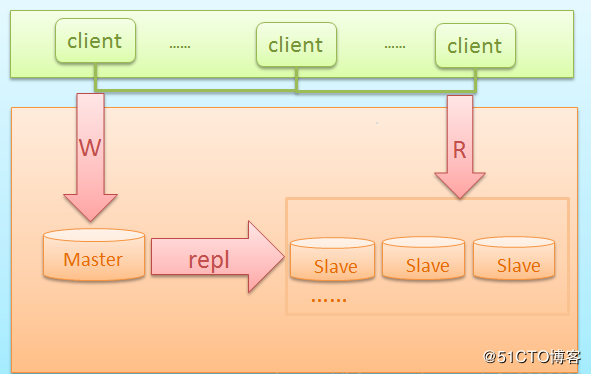
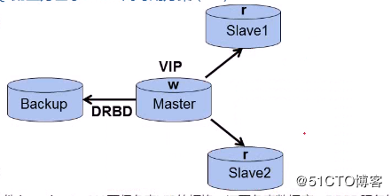
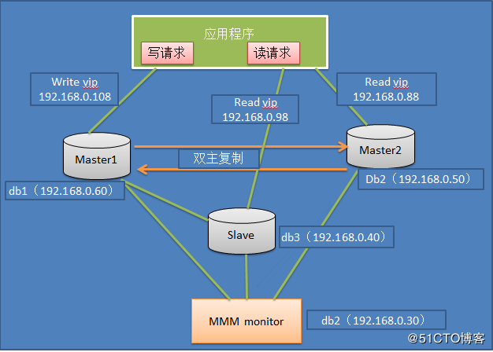
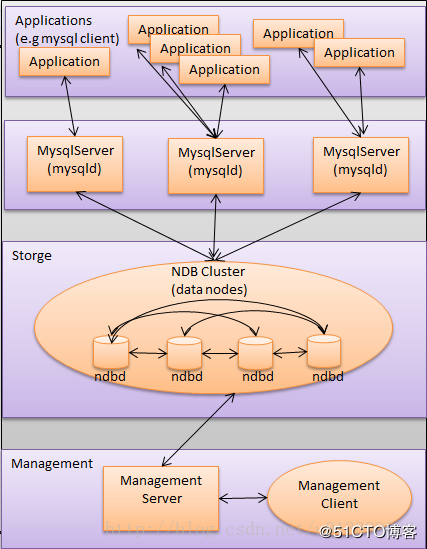

# About Big Data Store And Analysic

一篇有关大数据量存储及分析的讨论

## 目录

## 概述

首先整理下跟大数据量存储及分析可能相关的技术及中间件

- Hadoop生态(Hbase, Spark, Hive等)
- Elasticsearch
- TiDB
- MySQL集群
- Greenplum
- PostgreSQL
- MPP

## 关心的问题

在关于大数据量的存储及分析的讨论时，我们比较关注于这些方案的如下方面：

- 在某个硬件资源设定下，最大支持多大数据量的存储
- 在某个级别数据量规模下，数据分析的性能如何
- 在某个级别数据量规模下，稳定性如何
- 后续集群规模需要扩展的情况下，扩展性如何？
- 集群最大规模是多少
- 管理集群是否有可靠方案
- 实施这套存储和分析方案，需要什么样的人员，多少？什么级别？

## Hadoop生态

## Elasticsearch

## TiDB

## MySQL集群

### MySQL集群参考文档一

[浅淡MySQL集群高可用架构](http://blog.51cto.com/mingongge/2052768)

第一种 主从同步架构

此种架构，一般初创企业比较常用，也便于后面步步的扩展

此架构特点：

1. 成本低，布署快速、方便
2. 读写分离
3. 还能通过及时增加从库来减少读库压力
4. 主库单点故障
5. 数据一致性问题（同步延迟造成）

第二种 Mysql+DRBD架构

通过DRBD基于block块的复制模式，快速进行双主故障切换，很大程度上解决主库单点故障问题

此架构特点：

1. 高可用软件可使用Heartbeat,全面负责VIP、数据与DRBD服务的管理
2. 主故障后可自动快速切换，并且从库仍然能通过VIP与新主库进行数据同步
3. 从库也支持读写分离，可使用中间件或程序实现

>DRBD 是内核模块方式实现的块级别同步复制技术、这里的同步级别是可以调整的。因为DRBD 是利用网卡进行块复制、如果这里用 Infiniband 进行传输、便可以有效处理高并发。这是种复制存储、说白点、更像是一台热备机器、与其说是存储的HA、倒不如说是保证数据安全。\
工业环境更多用在 NFS 服务器、并结合 Linux-HA 项目、如 Packmaker、Heartbeat 等\
\
很多人谈 DRBD 脑裂而色变、用过就知道了、脑裂不是那么容易就发生的，DRBD 注意不设置自动启动、重启时候手动启动、脑裂的情况发生非常的少。\
工作中基本不重启 DRBD、更不会重启服务器了、基本上没遇到脑裂的问题\
\
摘自 [MySQL 磁盘复制技术--DRBD：优缺点比较、注意事项以及最佳实践](https://www.linuxidc.com/Linux/2013-06/85235.htm)

[Heartbeat+DRBD+MySQL高可用方案](https://www.cnblogs.com/gomysql/p/3674030.html)

第三种 Mysql+MHA架构

MHA目前在Mysql高可用方案中应该也是比较成熟和常见的方案，它由日本人开发出来，在mysql故障切换过程中，MHA能做到快速自动切换操作，而且还能最大限度保持数据的一致性

此架构特点：

1. 安装布署简单，不影响现有架构
2. 自动监控和故障转移
3. 保障数据一致性
4. 故障切换方式可使用手动或自动多向选择
5. 适应范围大（适用任何存储引擎）

第四种 Mysql+MMM架构

MMM即Master-Master Replication Manager for MySQL（mysql主主复制管理器），是关于mysql主主复制配置的监控、故障转移和管理的一套可伸缩的脚本套件（在任何时候只有一个节点可以被写入），这个套件也能基于标准的主从配置的任意数量的从服务器进行读负载均衡，所以你可以用它来在一组居于复制的服务器启动虚拟ip，除此之外，它还有实现数据备份、节点之间重新同步功能的脚本。

MySQL本身没有提供replication failover的解决方案，通过MMM方案能实现服务器的故障转移，从而实现mysql的高可用。

此方案特点：

1. 安全、稳定性较高，可扩展性好
2. 对服务器数量要求至少三台及以上
3. 对双主（主从复制性要求较高）
4. 同样可实现读写分离

第五种 官方mysql cluster方案

Mysql官方推出的集群高可用方案，由于本人没有用过，不好评价

摘自网络上的一段解释

>MySQL Cluster 由一组计算机构成，每台计算机上均运行着多种进程，包括 MySQL 服务器，NDB Cluster的数据节点，管理服务器，以及（可能）专门的数据访问程序。\
由于MySQL Cluster架构复杂，部署费时（通常需要DBA几个小时的时间才能完成搭建），而依靠 MySQL Cluster Manager 只需一个命令即可完成，但 MySQL Cluster Manager 是收费的。并且业内资深人士认为NDB 不适合大多数业务场景，而且有安全问题。因此，使用的人数较少。\
\
有兴趣的可以研究下官方文档：\
https://dev.mysql.com/doc/refman/5.7/en/mysql-cluster-install-linux.html

参考[浅淡MySQL集群高可用架构](http://blog.51cto.com/mingongge/2052768)

### MySQL集群参考文档二

[MySQLFabric、MySQL分片高可用集群之MySQLCluster、较成熟的集群方案GaleraCluster的部署使用优缺点详细讲解](https://www.2cto.com/database/201804/736048.html)

### MySQL集群参考文档三

[MySQL常用集群方案](https://blog.csdn.net/annotation_yang/article/details/80860988)

### MySQL集群参考文档四

组建MySQL集群的几种方案

- LVS+Keepalived+MySQL（有脑裂问题？但似乎很多人推荐这个）
- DRBD+Heartbeat+MySQL（有一台机器空余？Heartbeat切换时间较长？有脑裂问题？）
- MySQL Proxy（不够成熟与稳定？使用了Lua？是不是用了他做分表则可以不用更改客户端逻辑？）
- MySQL Cluster （社区版不支持INNODB引擎？商用案例不足？）
- MySQL + MHA （如果配上异步复制，似乎是不错的选择，又和问题？）
- MySQL + MMM （似乎反映有很多问题，未实践过，谁能给个说法）

回答：

不管哪种方案都是有其场景限制 或说 规模限制，以及优缺点的。

1. 首先反对大家做读写分离，关于这方面的原因解释太多次数（增加技术复杂度、可能导致读到落后的数据等），只说一点：99.8%的业务场景没有必要做读写分离，只要做好数据库设计优化 和配置合适正确的主机即可。
2. Keepalived+MySQL --确实有脑裂的问题，还无法做到准确判断mysqld是否HANG的情况；
3. DRBD+Heartbeat+MySQL --同样有脑裂的问题，还无法做到准确判断mysqld是否HANG的情况，且DRDB是不需要的，增加反而会出问题；
3. MySQL Proxy -- 不错的项目，可惜官方半途夭折了，不建议用，无法高可用，是一个写分离；
4. MySQL Cluster -- 社区版本不支持NDB是错误的言论，商用案例确实不多，主要是跟其业务场景要求有关系、这几年发展有点乱不过现在已经上正规了、对网络要求高；
5. MySQL + MHA -- 可以解决脑裂的问题，需要的IP多，小集群是可以的，但是管理大的就麻烦，其次MySQL + MMM 的话且坑很多，有MHA就没必要采用MMM

建议：

1. 若是双主复制的模式，不用做数据拆分，那么就可以选择MHA或 Keepalive 或 heartbeat
2. 若是双主复制，还做了数据的拆分，则可以考虑采用Cobar；
3. 若是双主复制+Slave，还做了数据的拆分，需要读写分类，可以考虑Amoeba；

上述所有的内容都要依据公司内部的业务场景、数据量、访问量、并发量、高可用的要求、DBA人群的数量等 综合权衡

[MySQL集群的几种方案](https://www.cnblogs.com/pangguoming/p/8241007.html)

## MPP

MPP即大规模并行处理（Massively Parallel Processor ）。 在数据库非共享集群中，每个节点都有独立的磁盘存储系统和内存系统，业务数据根据数据库模型和应用特点划分到各个节点上，每台数据节点通过专用网络或者商业通用网络互相连接，彼此协同计算，作为整体提供数据 库服务。非共享数据库集群有完全的可伸缩性、高可用、高性能、优秀的性价比、资源共享等优势。

MPP架构特征

- 任务并行执行
- 数据分布式存储(本地化)
- 分布式计算
- 私有资源
- 横向扩展
- Shared Nothing架构

常见MPPDB

- GREENPLUM(EMC)
- Asterdata(Teradata)
- Nettezza(IBM)
- Vertica(HP)
- GBase 8a MPP cluster(南大通用)

MPPDB、Hadoop与传统数据库技术对比与适用场景

对比表格参考[MPP(大规模并行处理)简介](https://blog.csdn.net/qq_42189083/article/details/80610092)

>elasticsearch也是一种MPP架构的数据库，Presto、Impala等都是MPP engine，各节点不共享资源，每个executor可以独自完成数据的读取和计算，缺点在于怕stragglers，遇到后整个engine的性能下降到该straggler的能力，所谓木桶的短板，这也是为什么MPP架构不适合异构的机器，要求各节点配置一样。\
\
Spark SQL应该还是算做Batching Processing, 中间计算结果需要落地到磁盘，所以查询效率没有MPP架构的引擎（如Impala）高。\
引用[MPP(大规模并行处理)简介](https://blog.csdn.net/qq_42189083/article/details/80610092)

## 其他问题

### 关系型数据库的选型

### 需要的硬件资源

### 改造点

### 改造工作量

### 改造工作时长

### 应用层使用什么样的程序来访问

### 改造后，是否支持sql存储过程之类的来生成报表、指标等

## 参考资料

### MPP部分

- [Hadoop 和 MPP 的比较【详细】](https://www.jianshu.com/p/5191daa1a454)
- [大数据基础知识问答----spark篇](https://blog.csdn.net/wangyaninglm/article/details/52403425?utm_source=blogxgwz6)
- [MPP架构](https://www.cnblogs.com/jianyungsun/p/9261632.html)
- [MPP(大规模并行处理)简介](https://blog.csdn.net/qq_42189083/article/details/80610092)

### Greenplum部分

- [Greenplum介绍](https://blog.csdn.net/dcpkeke/article/details/79003170)
- [Greenplum企业应用实战（笔记）：第七章 Greenplum 架构介绍](https://www.jianshu.com/p/105cb516a122)
- [海量数据处理利器greenplum——初识](https://www.cnblogs.com/skyme/p/5779885.html)
