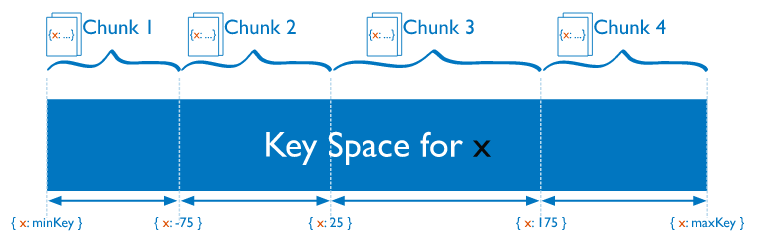

# MongoDB Sharding

[MongoDB官方文档/Sharding](https://docs.mongodb.com/manual/sharding/)

本文翻译自 [MongoDB官方文档/Sharding/data partitioning](https://docs.mongodb.com/manual/core/sharding-data-partitioning/)

## Data Partitioning with Chunks

MongoDB uses the shard key associated to the collection to partition the data into chunks. A chunk consists of a subset of sharded data. Each chunk has a inclusive lower and exclusive upper range based on the shard key.

MongoDB根据Collection关联的shard key来将数据partition到不同的chunks。一个chunk由一系列的sharded data组成。每个chunk根据shard key决定数据范围。



The mongos routes writes to the appropriate chunk based on the shard key value. MongoDB splits chunks when they grow beyond the configured chunk size. Both inserts and updates can trigger a chunk split.

The smallest range a chunk can represent is a single unique shard key value. A chunk that only contains documents with a single shard key value cannot be split.

## 自己笔记

### writeConcern

MongoDB支持客户端灵活配置写入策略（writeConcern），以满足不同场景的需求。

```JavaScript
db.collection.insert({x: 1}, {writeConcern: {w: 1}})
```

writeConcern选项

MongoDB支持的WriteConncern选项如下

    w: <number>，数据写入到number个节点才向用客户端确认
        {w: 0} 对客户端的写入不需要发送任何确认，适用于性能要求高，但不关注正确性的场景
        {w: 1} 默认的writeConcern，数据写入到Primary就向客户端发送确认
        {w: "majority"} 数据写入到副本集大多数成员后向客户端发送确认，适用于对数据安全性要求比较高的场景，该选项会降低写入性能

    j: <boolean> ，写入操作的journal持久化后才向客户端确认
        默认为"{j: false}，如果要求Primary写入持久化了才向客户端确认，则指定该选项为true

    wtimeout: <millseconds>，写入超时时间，仅w的值大于1时有效。
        当指定{w: }时，数据需要成功写入number个节点才算成功，如果写入过程中有节点故障，可能导致这个条件一直不能满足，从而一直不能向客户端发送确认结果，针对这种情况，客户端可设置wtimeout选项来指定超时时间，当写入过程持续超过该时间仍未结束，则认为写入失败。

### readConcern

MongoDB 可以通过 writeConcern 来定制写策略，3.2版本后又引入了 readConcern 来灵活的定制读策略。

#### readConcern vs readPreference

MongoDB 控制读策略，还有一个 readPreference 的设置，为了避免混淆，先简单说明下二者的区别。

    readPreference 主要控制客户端 Driver 从复制集的哪个节点读取数据，这个特性可方便的实现读写分离、就近读取等策略。
        primary 只从 primary 节点读数据，这个是默认设置
        primaryPreferred 优先从 primary 读取，primary 不可服务，从 secondary 读
        secondary 只从 scondary 节点读数据
        secondaryPreferred 优先从 secondary 读取，没有 secondary 成员时，从 primary 读取
        nearest 根据网络距离就近读取

    readConcern 决定到某个读取数据时，能读到什么样的数据。
        local 能读取任意数据，这个是默认设置
        majority 只能读取到『成功写入到大多数节点的数据』

readPreference 和 readConcern 可以配合使用。

#### readConcern 解决什么问题？

readConcern 的初衷在于解决『脏读』的问题，比如用户从 MongoDB 的 primary 上读取了某一条数据，但这条数据并没有同步到大多数节点，然后 primary 就故障了，重新恢复后 这个primary 节点会将未同步到大多数节点的数据回滚掉，导致用户读到了『脏数据』。

当指定 readConcern 级别为 majority 时，能保证用户读到的数据『已经写入到大多数节点』，而这样的数据肯定不会发生回滚，避免了脏读的问题。

需要注意的是，readConcern 能保证读到的数据『不会发生回滚』，但并不能保证读到的数据是最新的，这个官网上也有说明。

>Regardless of the read concern level, the most recent data on a node may not reflect the most recent version of the data in the system.

有用户误以为，readConcern 指定为 majority 时，客户端会从大多数的节点读取数据，然后返回最新的数据。

实际上并不是这样，无论何种级别的 readConcern，客户端都只会从『某一个确定的节点』（具体是哪个节点由 readPreference 决定）读取数据，该节点根据自己看到的同步状态视图，只会返回已经同步到大多数节点的数据。

### Replication

[replication](https://docs.mongodb.com/manual/replication/)

Replication in MongoDB

>A replica set is a group of mongod instances that maintain the same data set. 

一个replica set包含多个data bearing nodes并且一个随机的仲裁节点(arbiter node).。这些data bearing nodes中, 有且仅有一个被认为是primary node其他的被认为是secondary nodes。

>The secondaries replicate the primary’s oplog and apply the operations to their data sets such that the secondaries’ data sets reflect the primary’s data set. If the primary is unavailable, an eligible secondary will hold an election to elect itself the new primary. For more information on secondary members, see Replica Set Secondary Members.

从节点复制主节点的oplog并且将这些操作应用到他们的data set中，这样从节点中的data sets反射了（reflect）主节点中的data set。

如果主节点不可用了，一个合格的从节点将会举行选举选择他自己为新的主节点。

>You may add an extra mongod instance to a replica set as an arbiter. Arbiters do not maintain a data set. The purpose of an arbiter is to maintain a quorum in a replica set by responding to heartbeat and election requests by other replica set members. Because they do not store a data set, arbiters can be a good way to provide replica set quorum functionality with a cheaper resource cost than a fully functional replica set member with a data set. If your replica set has an even number of members, add an arbiter to obtain a majority of votes in an election for primary. Arbiters do not require dedicated hardware. For more information on arbiters, see Replica Set Arbiter.

可以添加额外的mongod示例到复制集中作为仲裁者。仲裁者不维护data set。仲裁者通过接收其他复制集中成员的心跳和选举请求，使复制集中维持一个法定投票人数（quorum）。

因为仲裁者本身不存储data set，一个仲裁者节点和一个全功能的复制集数据节点相比，仲裁者可以使复制集以一个较低的资源消耗保持法定投票人数。

如果你的复制集中拥有偶数个成员，添加一个仲裁者可以在选举主节点时不出现平票的情况。仲裁者不需要专属的硬件。

>An arbiter will always be an arbiter whereas a primary may step down and become a secondary and a secondary may become the primary during an election.

在选举中主节点可以成为从节点，从节点可以成为主节点，而仲裁者永远只能是仲裁者。

>Replica Set Arbiter\
\
An arbiter does not have a copy of data set and cannot become a primary. Replica sets may have arbiters to add a vote in elections for primary. Arbiters always have exactly 1 election vote, and thus allow replica sets to have an uneven number of voting members without the overhead of an additional member that replicates data.

## 附录1-术语

术语(glossary)

参考 [glossary](https://docs.mongodb.com/manual/reference/glossary/)

### shard key

参考 [sharding-shard-key](https://docs.mongodb.com/manual/core/sharding-shard-key/#shard-key)

The shard key determines the distribution of the collection’s documents among the cluster’s shards. The shard key is either an indexed field or indexed compound fields that exists in every document in the collection.

shard key决定集群中的文档的散布。shard key可以是index，也可以是compound列（两个或多个字段）

>compound index\
An index consisting of two or more keys. See Compound Indexes.

### route
