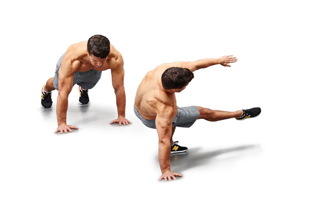
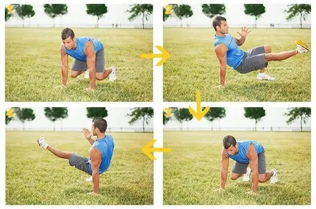

# A Brief Introduction Of Fitness

一个健身简介

## 概述

这篇文章主要描述及介绍我最近接触的健身方法及健身概念。

波比跳、开合跳、Side Kick Through、Animal Flow

## 健身组数与强度

参考 [健身组数和强度问题，我该怎么快速增肌？ - 倩Sur的回答 - 知乎](https://www.zhihu.com/question/38091893/answer/534042475)

参考 [增肌来说，每组的8-12rm需要严格执行“rm”吗？ - 陈柏龄的回答 - 知乎](https://www.zhihu.com/question/302322732/answer/541624271)

## 开合跳

### 动作

Step1 站姿跳跃，双脚往外张开约1.5个肩膀宽，双手往头顶方向击掌，注意手肘尽量伸直在头部两侧夹紧，可同时使身体往上延伸。

Step2 再跳一次后双脚并拢，双手拍大腿两侧，注意身体仍要往头顶方向延伸，尽量不要驼背。重复动作1至2共约30秒。

锻炼目标：热身动作、肩膀、手臂、腿部等肌肉的锻练。心肺能力。燃脂。

建议数量：90、120、150、240，选个数量分为三组完成，每组休息60秒，组间可以踏步和滑步缓和。

参考自

- [开合Jumping Jack跳减肥!开合跳动作要领](https://www.jianshen8.com/jihua/jianshenfang/8491.html)
- [百度百科-开合跳](https://baike.baidu.com/item/%E5%BC%80%E5%90%88%E8%B7%B3/20220572?fr=aladdin)

## 波比跳

波比运动，一种常见的健身运动。Burpee(波比)是一种高强度，短时间燃烧脂肪，令人心跳率飙升的自重阻力训练动作之一，也叫作立卧撑。

### 运动介绍

Burpee结合了深蹲(Squat)、伏地挺身(Push-Ups)及跳跃(Jump)一连串的动作，在短时间内会将心跳率拉升到将近人体最大值。

#### 运动作用

Burpee会训练到全身百分之70以上的肌肉群，包含核心肌群、脚、手臂、腹部、臀部及背部等，除了训练肌耐力、弹性、活动性外，它对于心肺适能(Cardiovascular Fitness)的训练也非常的有帮助。

Burpee被称为是最有效率、最好的全身健身(full-body exercise)项目之一，常被列为燃脂、瘦身的运动课程的项目之一，所需空间不大，在短时间内即可达到全身飙汗的运动。Burpee(波比)它十分相似我们的立卧撑跳，是力量和有氧训练计划中常见的全身练习动作

#### 练习形式

有运动基础的小伙伴们，你可能可以跑一小时无压力了，但是是否能坚持五轮Burpees不喘呢！如果可以。你可以加快你的动作节奏缩短间歇时间。再串连其他的训练动作完成高强度的训练课

1. Burpee可以当作一个独立的训练菜单，也可以和其他动作搭配组合，一般来说有几种的方式，供大家自行选择。
2. 每做N次的Burpee，休息M秒，这样为一个循环，重复做C个循环。比方说，每做5次Burpee，休息30秒，持续做15个循环。
3. 在N秒内，做最多下的Burpee，休息M秒，这样为一个循环，重复做C个循环。比方说，在45秒，做最多下的Burpee，休息30秒，重复做15个循环。
4. 不休息的方式，一直做Burpee，直到做不下去为止。
5. 不休息的方式，一直做Burpee，撑到100次。

#### 动作分解

1. Squatting Down(下蹲)
2. Leg Thrust(后踢脚)
3. Push-Up(俯卧撑)
4. Forward Jump(前跳)
5. Vertical Jump(垂直跳)

参考自 [百度百科-波比跳](https://baike.baidu.com/item/%E6%B3%A2%E6%AF%94%E8%BF%90%E5%8A%A8/16379299?fromtitle=%E6%B3%A2%E6%AF%94%E8%B7%B3&fromid=22747520&fr=aladdin)

## Side Kick Through

### 这个动作好在哪里？

这个动作不仅考验到你的肌肉力量、

更是对灵活性、协调性的考验；

旋转加踢腿给核心带来较强的负荷，

帮助发展核心力量；

转体帮助增加脊椎活动度；

单臂的支撑和肱骨的外旋，

有助于增强肩袖肌群及其稳定性、活动范围。

同时，它还是一个全身参与的多关节复合运动，

对心肺功能有显著的提升作用；

### 动作要点

起始姿势为一个平板，手掌在肩膀下方。

右腿踢向身体左侧，同时左手离地、

右手与左脚支撑在地面，

保持整个身体的平衡；

接下来换边，重复。

移动的时候不要图快，

要有控制的完成动作。

其实，这个动作也是**Animal Flow**的一种。

参考自 [知乎专栏-比波比跳更高效的燃脂动作，正在席卷全球...](https://zhuanlan.zhihu.com/p/32588883)

## 饮食与健康

diet and health

### 热量单位转换

1千焦(kJ)=238.9卡路里(cal)

1卡(cal)=0.001大卡(kcal)

### 食物热量

食物热量可以参考 [薄荷-食物热量查询](http://www.boohee.com/food/)

### 基础代谢