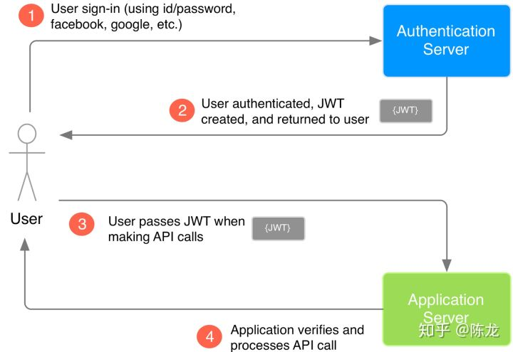

# authentication with currrent front end framework

## 概述

Angular，VUE，React等前端框架全是通过接口获得数据，我怎么记录用户登录状态？

一般网站都是记录session来记录登录状态，现在的单页应用(例如Ant Design Pro)怎么记录登录状态？

参考自：

[现代的前端框架全是通过API获得数据，如何记录用户登录状态？ - 陈龙的回答 - 知乎](https://www.zhihu.com/question/301253397/answer/527408312)

## 解决方案

问题描述说一般网站都是记录session.....，但是现在更趋向于stateless。服务器端不维护回话状态(session或成为state)，更有利于服务的横向扩展。

所以现在JWT(JSON Web Token)的认证方式更为流行，已经是业界标准了。[参考JWT](https://jwt.io/)

用户提交账号密码，服务器端进行验证。验证通过以后，服务器端会用自己的密钥把用户信息加密成Token返回给前端。前端拿到Token之后保存(一般放在Session/Local Storage里)，每次向服务器端发送请求都会在Request的Header里面带上

```Java
Authorization: bearer token...
```

服务器端用自己的密钥解析token，如果能解析就是自己认证的用户。


Github上一个Spring AntD的项目做参考：
[spring-security-react-ant-design-polls-app](https://github.com/callicoder/spring-security-react-ant-design-polls-app)

如果想了解JWT和Session/Cookies的对比，可以看一下这篇文章：
[json-web-tokens-vs-session-cookies](https://ponyfoo.com/articles/json-web-tokens-vs-session-cookies)

关于限制用户只能登录一次的问题，可以看这个Stackoverflow得答案：
[jwt-and-one-session-per-user-no-concurrent-sessions](https://stackoverflow.com/questions/28683698/jwt-and-one-session-per-user-no-concurrent-sessions)

在JWT的内容中有一个属性是ist:

```JSON
{
  "sub": "1234567890",
  "name": "John Doe",
  "iat": 1516239022
}
```

iat是Issued At的意思，就是分发这个Token的时间。每次用户登录，都检查一下当前登录的时间是否比这个分发时间晚，那就说明这次登录是已经有了这个token之后的行为。

## 参考资料

- [现代的前端框架全是通过API获得数据，如何记录用户登录状态？ - 陈龙的回答 - 知乎](https://www.zhihu.com/question/301253397/answer/527408312)
- [JWT过期刷新问题，实现十五天免登陆](https://zhuanlan.zhihu.com/p/57608281)
