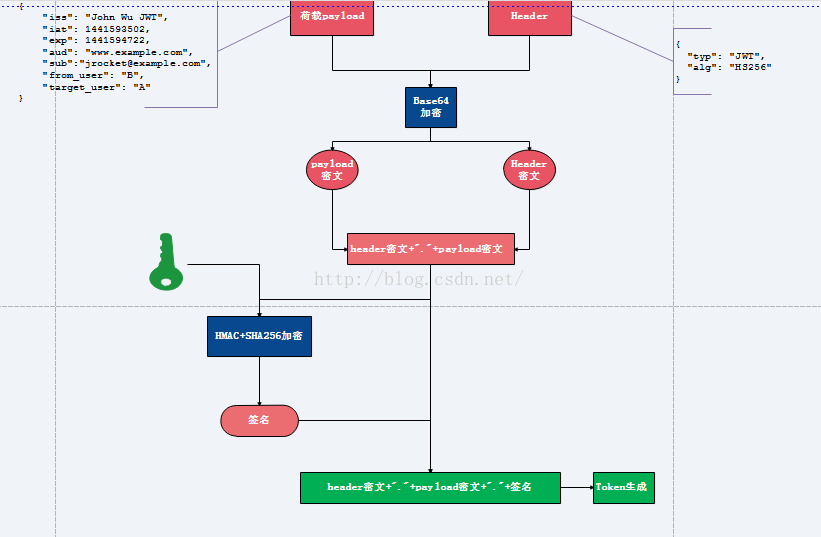

# 介绍Token

## Token原理以及应用

Token原理介绍

1. 将荷载payload，以及Header信息进行Base64加密，形成密文payload密文，header密文。

2. 将形成的密文用句号链接起来，用服务端秘钥进行HS256加密，生成签名.

3. 将前面的两个密文后面用句号链接签名形成最终的token返回给服务端

注：

1. 用户请求时携带此token（分为三部分，header密文，payload密文，签名）到服务端，服务端解析第一部分（header密文），用Base64解密，可以知道用了什么算法进行签名，此处解析发现是HS256。

2. 服务端使用原来的秘钥与密文(header密文+"."+payload密文)同样进行HS256运算，然后用生成的签名与token携带的签名进行对比，若一致说明token合法，不一致说明原文被修改。

3. 判断是否过期，客户端通过用Base64解密第二部分（payload密文），可以知道荷载中授权时间，以及有效期。通过这个与当前时间对比发现token是否过期。

## 参考资料

[Token原理以及应用](https://blog.csdn.net/u010288264/article/details/52004169)

[基于Token的WEB后台认证机制](http://www.cnblogs.com/xiekeli/p/5607107.html)

[基于 Token 的身份验证](https://blog.csdn.net/qq_28098067/article/details/52036493)
