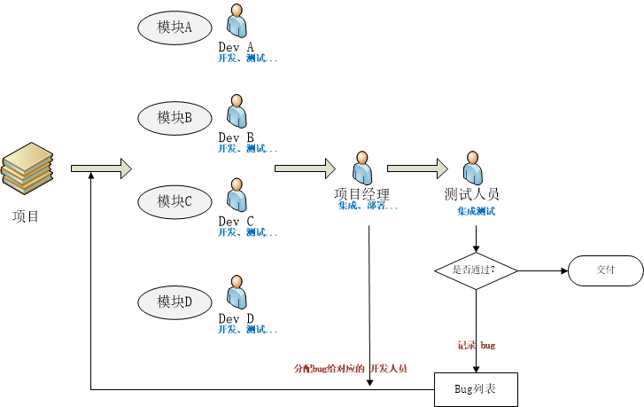
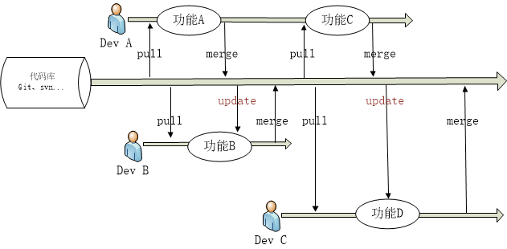

# continuous-integration

## 概述

## 传统开发模式与持续集成

### 传统开发模式

#### 存在的问题

1. Bug总是在最后才出现。

    备注：bug可能是由于单个功能集成到一起导致

2. 越到项目后期，问题越难解决。

    备注：项目后期时间比较紧。尤其是前期功能延误的情况下，供解决问题的时间更少。

3. 软件交付时机无法保障。

4. 程序经常需要变更。

    某些项目中，程序会经常需要变更，特别是敏捷开发实践者。

    备注：这一点目前来看持续集成并不能解决这个问题

5. 无效的等待变多。

    开发在等待集成其他人的模块，测试人员在等待开发修复Bug，产品经理在等待新版本上线给客户做演示，项目经理在等待其他人提交代码。

6. 用户的满足度低。

### 持续集成

#### 持续集成的好处

1. 解放了重复性劳动。

    自动化部署工作可以解放集成、测试、部署等重复性劳动，而机器集成的频率明显比手工高很多。

2. 更快地修复问题。

    持续集成更早的获取变更，更早的进入测试，更早的发现问题，解决问题的成本显著下降。

    备注：更早地将单独功能集成，避免集成的问题。

3. 更快的交付成果。

    更早发现错误减少解决错误所需的工作量。集成服务器在构建环节发现错误可以及时通知开发人员修复。集成服务器在部署环节发现错误可以回退到上一版本，服务器始终有一个可用的版本。

4. 减少手工的错误。

    在重复性动作上，人容易犯错，而机器犯错的几率几乎为零。

5. 减少了等待时间。

    缩短了从开发、集成、测试、部署各个环节的时间，从而也就缩短了中间可以出现的等待时机。持续集成，意味着开发、集成、测试、部署也得以持续。

6. 更高的产品质量。

    集成服务器往往提供代码质量检测等功能，对不规范或有错误的地方会进行标致，也可以设置邮件和短信等进行警告。

#### 持续集成的最佳实践

1. 频繁检出代码。

    有时候代码冲突无可避免，频繁检出代码，可以让本地的副本和代码库中的版本最小差异化。

2. 频繁提交代码。

    与1的原理类似，频繁提交代码，可以让其他人检出副本和代码库中的版本最小差异化。

3. 减少分支，回归主干。

    多个分支并行应及早将变更集成到主干中，避免同时维护软件的多个版本。

4. 使用自动化构建。

    可以使用Maven、Ant等来实现自动化构建，可以在构建过程中实现自动化测试。前提是有写单元测试用例。

5. 提交测试。

    在提交工作之前，每个程序员必须本地集成所有代码，做一个完整的构建和运行，并通过所有的单元测试，这样能减少集成测试在集成服务器上构建失败的风险。

6. 当前状态对每个人都可见。

    集成服务器在持续集成过程中发现问题应及时发送警告给相关的干系人。

#### 参考

 [「CI」为什么要持续集成 廖雪青](https://www.jianshu.com/p/1cd01bcc77f2)

>Martin Fowler 说过，”持续集成并不能消除 Bug，而是让它们非常容易发现和改正。”

### 个人备注

持续集成更多的是为了解决功能“集成”的问题，即开发人员开发了单独的功能，并且单独功能单元测试通过，那么能否保证集成到一起后功能还正常呢？持续集成就是为了解决这个问题。

## 相似概念

最近看了一篇文章 The Product Managers' Guide to Continuous Delivery and DevOps 文中对「持续集成（Continuous Integration）」、「持续交付（Continuous Delivery）」和「持续部署（Continuous Deployment）」这三个概念有很详细的解释。这里借用文中的插图，说一下我对这三个概念的理解。

参考 [如何理解持续集成、持续交付、持续部署 yumminhuang的回答](https://www.zhihu.com/question/23444990/answer/89426003)

### 持续集成

持续集成强调开发人员提交了新代码之后，立刻进行构建、（单元）测试。根据测试结果，我们可以确定新代码和原有代码能否正确地集成在一起。

### 持续交付

持续交付在持续集成的基础上，将集成后的代码部署到更贴近真实运行环境的「类生产环境」（production-like environments）中。比如，我们完成单元测试后，可以把代码部署到连接数据库的 Staging 环境中更多的测试。如果代码没有问题，可以继续手动部署到生产环境中。

### 持续部署

持续部署则是在持续交付的基础上，把部署到生产环境的过程自动化。

## 参考资料

[知乎话题-持续集成](https://www.zhihu.com/search?type=content&q=%E6%8C%81%E7%BB%AD%E9%9B%86%E6%88%90)

[知乎文章-什么是持续集成（CI）/持续部署（CD）？](https://zhuanlan.zhihu.com/p/42286143)

[jenkins持续集成原理](https://www.cnblogs.com/liyuanhong/p/6548925.html)

[知乎话题-持续集成CI](https://www.zhihu.com/topic/19603714/hot)

[知乎专栏-Jenkins](https://zhuanlan.zhihu.com/c_193701892)

[Gitlab CI 与 DevOps](https://zhuanlan.zhihu.com/p/35749347)

[如何理解持续集成、持续交付、持续部署？](https://www.zhihu.com/question/23444990/answer/89426003)

[The Product Managers’ Guide to Continuous Delivery and DevOps](https://www.mindtheproduct.com/2016/02/what-the-hell-are-ci-cd-and-devops-a-cheatsheet-for-the-rest-of-us/)

[Github 欢迎所有的持续集成工具](https://zhuanlan.zhihu.com/p/30889388)

[「CI」为什么要持续集成](https://www.jianshu.com/p/1cd01bcc77f2)

[什么是持续集成？该怎么做？](http://network.51cto.com/art/201801/563064.htm)

## 相关工具

[8个流行的持续集成工具](https://www.testwo.com/article/1170)

[代码扫描 SonarQube](https://www.sonarqube.org/)

[Gerrit Code Review](https://www.gerritcodereview.com/)